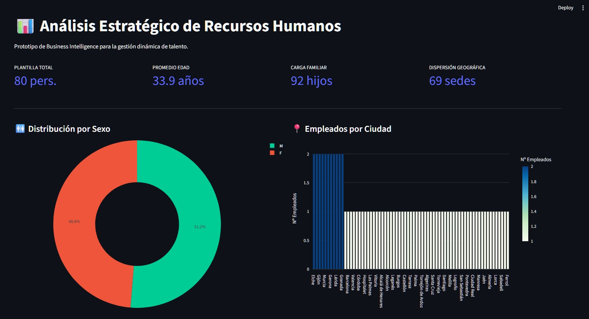
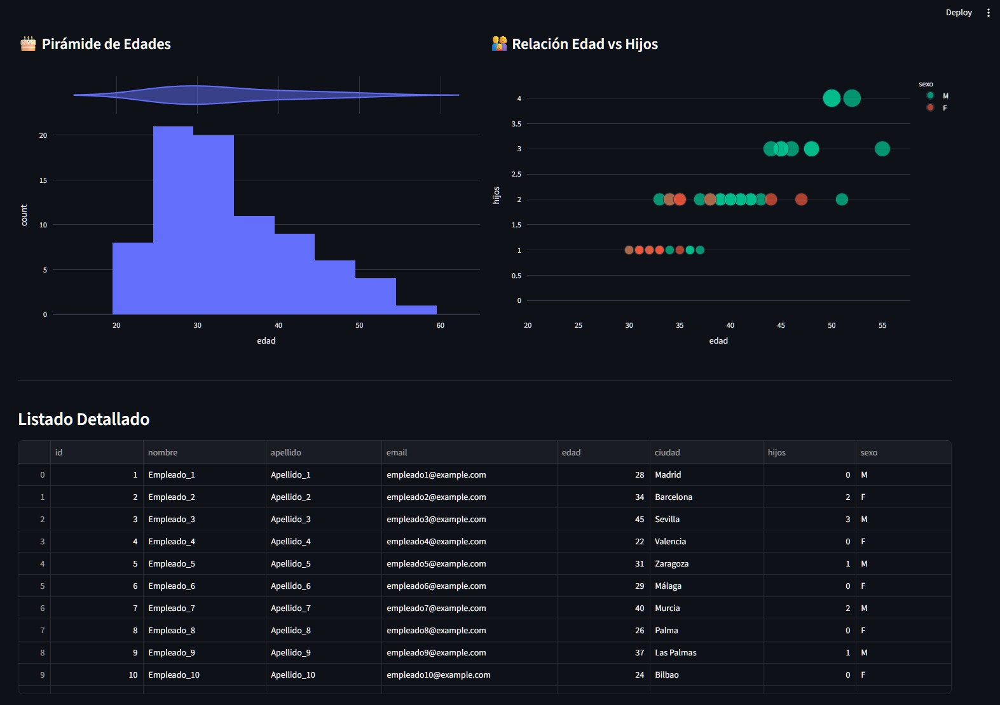

# PoC: Solución Integral de Gestión de RRHH (ETL + Dashboard)


Esta **Prueba de Concepto (PoC)** demuestra una solución **"Zero-Config"** de ingeniería de datos para el área de Recursos Humanos. El proyecto es totalmente autónomo: al iniciar el panel de control, se encarga de orquestar la infraestructura, procesar los datos (ETL) y generar la visualización.

## 📊 Vista Previa del Dashboard



## 🔄 Transformación de Datos (ETL)
El proyecto demuestra el flujo completo desde datos en bruto hasta Business Intelligence:

### 1. Datos de Origen (CSV)
Los datos entran al sistema en formato de texto plano, facilitando la exportación desde otros sistemas de RRHH:
```csv
id,nombre,apellido,email,edad,ciudad,hijos,sexo
1,Empleado_1,Apellido_1,empleado1@example.com,28,Madrid,0,M
2,Empleado_2,Apellido_2,empleado2@example.com,34,Barcelona,2,F
...
```

### 2. Proceso ETL & Almacenamiento
Un script de Python lee el CSV dinámicamente, realiza la limpieza y lo inserta en una base de datos **MySQL** dockerizada, optimizando los tipos de datos y creando índices de búsqueda.

### 3. Visualización Estratégica
Streamlit consume los datos de MySQL en tiempo real para generar el informe interactivo que permite la toma de decisiones basada en datos.

## 🚀 Características Principales (End-to-End)

*   **Infraestructura Inteligente**: El sistema detecta si el entorno Docker (MySQL + phpMyAdmin) está activo. Si no lo está, lo levanta automáticamente.
*   **Pipeline ETL Automatizado**: Si la base de datos está vacía, el script carga y limpia dinámicamente los datos desde un CSV anonimizado.
*   **Cuadro de Mandos Interactivo**: Visualización avanzada de métricas clave (KPIs), demografía por edad, sexo y ubicación geográfica.
*   **Diseño Profesional**: Datos anonimizados, gestión de dependencias mediante `venv` y documentación completa.

## 🛠️ Stack Tecnológico

*   **Backend & ETL**: Python 3.12+ (Pandas, SQLAlchemy, PyMySQL).
*   **Infraestructura**: Docker & Docker Compose (MySQL 8.0, phpMyAdmin).
*   **Frontend**: Streamlit & Plotly para gráficos interactivos.

## 📋 Requisitos Previos

*   [Docker Desktop](https://www.docker.com/products/docker-desktop/) instalado y en ejecución.
*   [Python 3.12+](https://www.python.org/downloads/).

## ⏱️ Guía de Inicio Rápido (Solo 2 pasos)

1.  **Configurar el entorno**:
    ```bash
    python -m venv venv
    venv\Scripts\activate
    pip install -r requirements.txt  # O instala: mysql-connector-python streamlit pandas plotly sqlalchemy pymysql
    ```

2.  **Lanzar la solución completa**:
    ```bash
    streamlit run app.py
    ```
    *El sistema se encargará de todo: levantar Docker, crear la DB, cargar los datos y abrir el navegador.*

## 📄 Licencia

Este proyecto está bajo la Licencia MIT. Consulta el archivo [LICENSE](LICENSE) para más detalles.

---
**Desarrollado como PoC Técnica** | Repositorio: [https://github.com/mglvillar/poc-etl-dashboard-rrhh-completo](https://github.com/mglvillar/poc-etl-dashboard-rrhh-completo)
